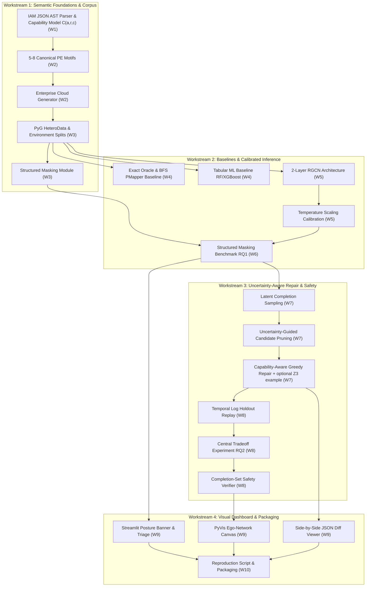

# Project Blueprint & Execution Schedule (10-Week Prototype & 18-Month Thesis Core + 6-Month Buffer)

### Project Title
**Uncertainty-Aware Least-Privilege Repair for Cloud IAM under Partial Observability**

### Author & Engineering Lead
Currently just me and myself.

---

## 1. Executive Summary & Schedule Overview

This blueprint translates the research and engineering objectives specified in [proposal.md](file:///Users/duke/IAM/proposal.md) into an actionable execution schedule. Its organizing principle is **hypothesis first**: establish whether the central hypothesis holds before building the full architecture.

**Frozen project architecture:**

```
Partial IAM Observability -> Calibrated Latent-Relation Inference -> Uncertainty-Aware Security/Utility Optimization
        -> Capability-Constrained Policy Repair -> Completion-Set Verification + Temporal Holdout
```

The dashboard is a deliverable, the RGCN is a method, and Z3/MaxSAT is a solver. The research contribution is **decision-making under partial authorization observability**.

* **Tier 1 (Weeks 1–10: Course Project & Research Prototype)**:
  Test the central question: *when a critical IAM relationship is hidden by a realistic missing-information condition, does a relational model recover useful information that exact traversal cannot, and can that information improve a repair decision?* The prototype is organized in priority layers (P0/P1/P2, Section 1.1) so the research experiment is never sacrificed to finish a UI.
* **Tier 2 (Months 1–18 core, Months 19–24 buffer: Master's Thesis)**:
  A phased plan with explicit go/no-go gates (Section 6). The 10-week prototype is months 1–3 of this plan. Months 19–24 are optional publication extension, not guaranteed work. The target hierarchy is: good thesis, then publishable paper, then strong venue if results warrant it.

```
+---------------------------------------------------------------------------------------------------------+
|                                    10-WEEK PHASE ROADMAP (TIER 1 PROTOTYPE)                             |
+---------------------------------------------------------------------------------------------------------+
| Phase 1: Semantic Foundations & Corpus (Weeks 1–3)        ───► [M1: Environment-Split IAM Corpus]       |
| Phase 2: Baselines, RGCN & Hypothesis Gate (Weeks 4–6)    ───► [M2: Structured Masking Benchmark + Gate]|
| Phase 3: Completion Sampling & Repair (Weeks 7–8)         ───► [M3: Tradeoff Experiment & Verifier]     |
| Phase 4: Dashboard (P2), Demo & Release (Weeks 9–10)      ───► [M4: Course Presentation & Prototype]    |
+---------------------------------------------------------------------------------------------------------+
|                      18-MONTH THESIS CORE + 6-MONTH PUBLICATION BUFFER (TIER 2)                         |
+---------------------------------------------------------------------------------------------------------+
| Months 1–3   (W1–12):   Course Prototype + hypothesis check            ───► Gate G0                     |
| Months 4–6   (W13–26):  Research Foundation (semantics, TAC-Bench)     ───► Gate G1                     |
| Months 7–10  (W27–43):  Core Method (uncertainty-aware repair)         ───► Gate G2                     |
| Months 11–14 (W44–60):  Rigorous Evaluation (IAMPERE, TAC, Refiner)    ───► Gate G3                     |
| Months 15–18 (W61–78):  Formalization, Thesis Writing & Defense                                         |
| Months 19–24 (W79–104): Optional publication extension (buffer)                                         |
+---------------------------------------------------------------------------------------------------------+
```

### Time Allocation & Workload Distribution Matrix (Tier 1)

| Phase | Weeks | Core Focus | Est. Hours | Cumulative Hours | Target Milestone |
| :--- | :--- | :--- | :---: | :---: | :--- |
| **Phase 1** | Week 1 | Environment Setup, IAM AST Parser & Data-Driven Capability Model C(a, r, c) | 16h | 16h | Verified IAM Semantic Parser & Capability Table |
| | Week 2 | 4 P0 (+2 P1) PE Motifs & Parameterized Enterprise Cloud Generator | 17h | 33h | Generator with Exact Ground-Truth PE Chains |
| | Week 3 | PyG HeteroData Pipeline, Environment-Level Splits & Structured Masking | 17h | 50h | **M1: Validated Inductive Corpus with Masking Operators** |
| **Phase 2** | Week 4 | Exact Oracle, BFS (PMapper-style), RF & Rule-Based Motif-Completion Baselines | 17h | 67h | Baseline Benchmark Suite |
| | Week 5 | 2-Layer RGCN, Bilinear Head, Calibration (P1) & Thin-Slice Experiment | 18h | 85h | First answer to the central question |
| | Week 6 | Structured Masking Experiments, Degradation Curves & Go/No-Go Gate | 18h | 103h | **M2: Latent Relation Benchmark (RQ1) + Gate G0** |
| **Phase 3** | Week 7 | Completion Sampling, Candidate Pruning & Capability-Aware Greedy Repair (+ P2 Z3 example) | 17h | 120h | Capability-Compliant Repair Engine |
| | Week 8 | Synthetic Temporal Workload, Completion-Set Verifier & Tradeoff Experiment | 17h | 137h | **M3: Security–Utility Tradeoff Evaluation (RQ2)** |
| **Phase 4** | Week 9 | Triage Dashboard (P2: scope to remaining time) | 17h | 154h | Visual Triage UI or static graph + JSON diff |
| | Week 10 | End-to-End Evaluation, Reproduction Script & Demo Packaging | 16h | 170h | **M4: Course Presentation & Open-Source Release** |
| **Total** | **10 Weeks** | **Tier 1 Lifecycle (Course Prototype & Thesis Foundation)** | **170h** | **170h** | **Reproducible Research Prototype** |

### 1.1 Priority Layers for the 10-Week Prototype

The effort estimates are uncertain, mainly because of AWS semantics and the definition of latent-path probability. Priorities decide what is cut when time runs short.

| Layer | Contents | Rule |
| :---: | :--- | :--- |
| **P0** | IAM semantic model → generator (4 motifs) → environment-level split → random (A) + adversarial-bridge (E) masking → exact oracle, BFS, RF, motif-completion heuristic → RGCN → PR-AUC / FNR / Recall@K → one clean demonstration | Required. Never trade P0 for P1/P2. |
| **P1** | Calibration (ECE), completion sampling, capability-aware greedy repair, synthetic temporal holdout, cross-account masking (B), 2 extra motifs | Simplify before dropping. |
| **P2** | Z3 prototype (one canonical example), polished dashboard, PyVis interactivity, condition-injection repair tier, masking conditions C and D | First to cut. |

**Fallback rules:** if the RGCN experiment is still unstable in Week 7, keep working on it instead of building the dashboard. If the solver runs long, show a single canonical Z3 example. If the dashboard is not ready, present a static graph and a JSON policy diff.

---

## 2. Detailed 10-Week Breakdown & Task Checklist (Tier 1)

---

### Week 1: Environment Setup, IAM Parsing & Action Capability Model
* **Goal**: Establish the repository infrastructure, build a correct AWS IAM JSON AST parser, and codify the AWS Action Capability Model $C(a, r, c)$ to prevent semantically invalid repairs.
* **Estimated Effort**: 16 Hours

#### Step 1.1: Core Environment & Toolchain Initialization (3.0h)
- [ ] Initialize Python 3.10+ virtual environment and dependency tree (`poetry` / `pip-tools`).
- [ ] Configure development tooling: `ruff` (linter/formatter), `pytest`, `mypy`, and pre-commit hooks.
- [ ] Install deep learning, graph, and constraint solver dependencies: `torch`, `torch_geometric`, `networkx`, `scipy`, `z3-solver`.
- [ ] Setup modular repository layout:
  ```
  iam-graph-learning/
  ├── data/                  # Synthetic schemas, generators, and split datasets
  ├── src/
  │   ├── parser/            # IAM AST, AWS action capability model C(a,r,c)
  │   ├── generator/         # Parameterized enterprise generator & PE motifs
  │   ├── models/            # PyG RGCN, calibration module, and baselines
  │   ├── optimizer/         # Candidate pruning, min-cut, and Z3 MaxSAT repair
  │   ├── verifier/          # Symbolic reachability checker & log replay
  │   └── dashboard/         # Streamlit and PyVis UI
  ├── tests/                 # Unit, integration, and benchmark tests
  └── scripts/               # Reproduction and benchmarking CLI scripts
  ```

#### Step 1.2: Declarative IAM JSON Schema & AST Parser (5.0h)
- [ ] Implement robust IAM policy document parser supporting standard statements (`Effect`, `Action`, `NotAction`, `Resource`, `NotResource`, `Condition`).
- [ ] Build wildcard expansion resolver (e.g., expanding `iam:*` or `s3:Get*` into canonical AWS action sets).
- [ ] Handle explicit `Deny` resolution adhering to AWS policy evaluation logic: an explicit `Deny` overrides any `Allow` across all scopes.
- [ ] Support conditional logic parsing (e.g., `aws:PrincipalArn`, `aws:MultiFactorAuthPresent`, `iam:PassedToService`).

#### Step 1.3: AWS Action–Resource–Condition Capability Model C(a, r, c) (4.5h)
- [ ] Build $C$ as a **data layer** derived from AWS's machine-readable Service Authorization Reference, stored as a versioned snapshot (record the snapshot date). Restrict to IAM, STS, Lambda, EC2, S3, and KMS for the prototype.
- [ ] Per action, record: supported resource types (e.g., `iam:PassRole` targets a role resource; `iam:CreateAccessKey` targets a user resource, so it can be scoped to a user ARN), whether the action is wildcard-only (verify from the snapshot, e.g., `iam:ListRoles`, `iam:GetAccountAuthorizationDetails`), and applicable condition keys (action, resource, and global keys).
- [ ] **Fallback (if ingestion exceeds ~2h):** hand-transcribe the table for the ~20 actions used by the PE motifs, with citation and snapshot date, using the same schema as the ingested output.
- [ ] Implement capability checker `is_valid_transformation(action, target_resource, condition)` to validate proposed patches.

#### Step 1.4: Unit Tests for IAM Parser & Capability Model (3.5h)
- [ ] Test wildcard expansion against edge cases (e.g., `iam:*AccessKey*`, action case-insensitivity).
- [ ] Test explicit `Deny` suppression on contradictory policy statements.
- [ ] Capability tests: scoping `iam:PassRole` to a role ARN is accepted; scoping `iam:CreateAccessKey` to a user ARN is accepted; scoping a wildcard-only action (e.g., `iam:ListRoles`) to an ARN is rejected; injecting a condition key not listed for the action is rejected.

---

### Week 2: Canonical PE Motifs & Parameterized Enterprise Cloud Generator
* **Goal**: Implement 5–8 high-frequency privilege escalation motifs with exact ground truth, and build a parameterized enterprise cloud generator.
* **Estimated Effort**: 17 Hours

#### Step 2.1: Canonical PE Motifs with Exact Ground Truth (5.0h)
- [ ] **P0 (required) - 4 motifs**, each with precise subgraph pattern and ground-truth reachability checker:
  1. `iam:PassRole` + `lambda:CreateFunction` + `lambda:InvokeFunction`
  2. `iam:CreateAccessKey` targeting an existing high-privilege user
  3. `iam:AttachRolePolicy` / `iam:AttachUserPolicy` attaching `AdministratorAccess`
  4. `sts:AssumeRole` multi-hop chaining across intermediate service roles
- [ ] **P1 (only if on schedule by end of Week 2):** `iam:PassRole` + `ec2:RunInstances` (instance profile elevation) and `iam:SetDefaultPolicyVersion`.
- [ ] Ensure motifs capture multi-step dependencies rather than trivial single-hop edges.
- [ ] For each motif, define its **bridge relation** (the critical relationship that adversarial masking, Condition E, will hide).

#### Step 2.2: Parameterized Enterprise Topology Generator (6.5h)
- [ ] Implement realistic departmental organizational hierarchy (DevOps, Data/BI, SecOps, QA, Billing, Interns).
- [ ] Model power-law identity distribution: small core of Admin/SecOps, moderate DevOps, large long-tail of restricted read-only roles.
- [ ] Incorporate benign business workflows:
  - CI/CD build runners with scoped S3 and ECR permissions.
  - Read-only data analysts querying Athena/S3 with strict KMS access.
- [ ] Support graph scaling parameters: $N \in [500, 5000]$ nodes with configurable edge density.
- [ ] Inject positive privilege escalation chains (configurable path lengths: 2-hop, 3-hop, 4-hop, and branching paths).

#### Step 2.3: Ground-Truth Verification & Environment Export (3.5h)
- [ ] Implement automated ground-truth labeler that outputs all reachable $(s, t)$ privilege escalation pairs and the exact sequence of intermediate edges.
- [ ] Compute topological sanity checks: in/out-degree distributions, clustering coefficients, and connected components.
- [ ] Export labeled graph datasets into structured JSON / NetworkX schemas.

#### Step 2.4: Generator Sanity Tests (2.0h)
- [ ] Verify that injected PE chains are syntactically valid and traversable.
- [ ] Ensure benign identities without escalation paths are not falsely annotated as positive escalation targets.
- [ ] Measure generator runtime across node scales (500, 1,000, 2,500, 5,000 nodes).

---

### Week 3: PyG Pipeline, Environment-Level Splits & Structured Masking
* **Goal**: Convert cloud graphs into PyTorch Geometric `HeteroData`, establish strict environment-level dataset splits to prevent synthetic memorization, and build the structured masking module.
* **Estimated Effort**: 17 Hours

#### Step 3.1: Vocabulary Building & Feature Representation (4.0h)
- [ ] Build global action permission dictionary across AWS services (IAM, STS, Lambda, EC2, S3, KMS, RDS).
- [ ] Multi-hot vector encoding for policy and principal nodes based on granted actions.
- [ ] Encode resource types and ARN service prefixes into one-hot categorical features.
- [ ] Compute topological centrality features: in-degree, out-degree per relation, and PageRank scores.

#### Step 3.2: PyG `HeteroData` Conversion (4.5h)
- [ ] Map NetworkX multigraph into `torch_geometric.data.HeteroData`.
- [ ] Build typed edge indices `edge_index_dict` for canonical relations:
  - `('User', 'MemberOf', 'Group')`
  - `('Principal', 'AssumesRole', 'Role')`
  - `('Principal', 'AttachedWith', 'Policy')`
  - `('Policy', 'ActsOn', 'Resource')`
  - `('Role', 'PassesTo', 'Resource')`
- [ ] Add inverse relations (e.g., `RevAssumesRole`, `RevAttachedWith`) to facilitate bidirectional message passing.

#### Step 3.3: Environment-Level Dataset Splitting (Preventing Generator Overfitting) (4.5h)
- [ ] **Crucial Scientific Safeguard:** Split datasets strictly by **Environment / Organization**, not by edges within the same graph:
  - Train set: Graphs from Organizations $\mathcal{O}\_1, \dots, \mathcal{O}\_8$
  - Validation set: Graphs from Organizations $\mathcal{O}\_9, \mathcal{O}\_{10}$
  - Held-out test set: Graphs from Organizations $\mathcal{O}\_{11}, \dots, \mathcal{O}\_{14}$ with different departmental sizes and branching factors.
- [ ] Implement inductive link prediction evaluation harness.
- [ ] Balanced negative sampling: sample non-escalating identity pairs across departments.

#### Step 3.4: Structured Masking Framework Setup (4.0h)
- [ ] Masking removes **authorization evidence and delegation relationships**, not necessarily literal static IAM edges. For every operator, document in code which AWS object is hidden and how it is represented in the graph.
  - **Condition A (P0, Random):** Randomly drop $p \in \{10\text{\%}, 20\text{\%}, 30\text{\%}, 40\text{\%}\}$ of intermediate trust/delegation relations.
  - **Condition E (P0, Adversarial Bridge):** Hide the bridge relation of the ground-truth escalation path.
  - **Condition B (P1, Cross-Account):** Hide all relations whose evidence lives in a designated unobservable account.
  - **Condition C (P2, Federated IdP):** The cloud-side OIDC/SAML trust policy stays visible; hide the external-principal-to-role delegation evidence, modeled as a distinct federated-delegation relation.
  - **Condition D (P2, Ephemeral STS):** Hide runtime session-derived delegation, modeled in the workload layer rather than as a persistent configuration edge.

---

### Week 4: Exact Symbolic Oracle, Deterministic BFS, Tabular ML & Rule-Based Baselines
* **Goal**: Implement evaluation baselines: an exact symbolic oracle, stateful BFS (PMapper proxy), Random Forest, and a rule-based motif-completion heuristic.
* **Estimated Effort**: 17 Hours

#### Step 4.1: Exact Symbolic Reachability Oracle (4.0h)
- [ ] Implement an exact stateful reachability oracle with full-graph access to establish the upper bound on detection.
- [ ] Output all valid $(s, t)$ escalation pairs with proof witnesses.

#### Step 4.2: Deterministic BFS Reachability Engine (PMapper Proxy) (4.0h)
- [ ] Implement stateful BFS over the observed graph $G_o$ with role-chaining handoffs, cycle detection, and max-depth bounding ($k \le 6$).
- [ ] Note: under Condition E, BFS fails by construction. It is a reference point, not the meaningful comparator for the RGCN.

#### Step 4.3: Classical ML and Rule-Based Baselines (6.0h)
- [ ] **P0:** Random Forest on tabular pair features: source/target degree, Jaccard and Adamic-Adar similarity, shortest-path distance in $G_o$, administrative permission counts. Class reweighting for sparsity. (XGBoost is P1.)
- [ ] **P0:** Rule-based **motif-completion heuristic**: if $G_o$ contains part of a known motif (e.g., a principal that can create Lambda functions and has `iam:PassRole` but no observed trust edge), infer the missing half with a prior score. This is the strongest simple baseline a reviewer will ask for; the RGCN must justify itself against it.

#### Step 4.4: Baseline Metrics Evaluation Suite (3.0h)
- [ ] Compute PR-AUC (primary, since positives are sparse), Recall@K, False Negative Rate, and attack-path recovery rate; ROC-AUC and MRR are secondary.
- [ ] Document BFS recall degradation under Conditions A and E.

---

### Week 5: 2-Layer RGCN Architecture, Bilinear Head, Calibration (P1) & Thin-Slice Experiment
* **Goal**: Implement the 2-layer RGCN and bilinear head, add post-hoc calibration (P1), and run a thin-slice experiment that gives a first answer to the central question before the full sweep.
* **Estimated Effort**: 18 Hours

#### Step 5.1: Multi-Relational Message Passing Layer (5.5h)
- [ ] Implement 2-layer `RGCNConv` module using PyG:

$$
h_i^{(l+1)} = \sigma \left( W_0^{(l)} h_i^{(l)} + \sum_{r \in \mathcal{R}} \sum_{j \in \mathcal{N}_i^r} \frac{1}{c_{i,r}} W_r^{(l)} h_j^{(l)} \right)
$$

- [ ] Basis-sharing regularization with $B = 8$ basis matrices to prevent parameter explosion:

$$
W_r^{(l)} = \sum_{b=1}^{B} a_{r,b}^{(l)} V_b^{(l)}
$$

- [ ] Add layer normalization, dropout ($p = 0.2$), and LeakyReLU activations ($d_{hidden} = 128$).

#### Step 5.2: Bilinear Latent Relation Decoder (3.5h)
- [ ] Implement a bilinear scoring head for hidden-relation triples $(u, r, v)$:

$$
\hat{y}_{uv} = \sigma \left( h_u^T W_{r} h_v + b_r \right)
$$

- [ ] Scope: this head solves **Problem 1, hidden-relation prediction**. Attacker–target reachability (Problem 2) is computed downstream from sampled completions (Step 7.1), **not** by multiplying edge probabilities, because hidden relations can be correlated.

#### Step 5.3: Uncertainty Calibration (P1) (3.5h)
- [ ] Temperature scaling on held-out validation environments:

$$
\hat{p}_{uv} = \sigma(z_{uv} / T)
$$

- [ ] Fit $T$ by negative log-likelihood under the same masking condition used at test time; compute ECE and reliability diagrams.

#### Step 5.4: Loss Formulation & Training Loop (3.5h)
- [ ] Binary cross-entropy with focal weighting ($\gamma = 2.0$), AdamW, cosine annealing, early stopping on validation PR-AUC.

#### Step 5.5: Thin-Slice Experiment (2.0h)
- [ ] Single motif (`PassRole` + Lambda), Condition E plus Condition A at 20%, training on train environments and testing on held-out environments.
- [ ] Compare RGCN vs RF vs motif-completion heuristic on Recall@K and PR-AUC for recovering the hidden bridge; produce one plot.
- [ ] This is the first answer to the central question. Do not proceed to the full sweep before looking at it.

---

### Week 6: Structured Masking Experiments, Degradation Analysis & Go/No-Go Gate (RQ1)
* **Goal**: Execute the core latent inference experiments on held-out environments and make an explicit decision about how the project proceeds.
* **Estimated Effort**: 18 Hours

#### Step 6.1: Experimental Sweep (6.0h)
- [ ] Run 5 random seeds. **P0:** Conditions A ($p \in \{0.0, 0.1, 0.2, 0.3, 0.4\}$) and E. **P1:** Condition B. **P2:** Conditions C and D.
- [ ] Models: exact oracle (reference), BFS, Random Forest, motif-completion heuristic, RGCN. Evaluate on held-out environments only.

#### Step 6.2: Metrics Compilation (4.0h)
- [ ] PR-AUC, Recall@K, FNR, attack-path recovery rate, and ECE (probabilistic models only).
- [ ] Report mean, variance, and 95% confidence intervals; plot degradation curves. Define the comparison criterion (e.g., non-overlapping 95% CIs on Recall@K) **before** running. No fixed "must reach 0.90" thresholds.

#### Step 6.3: Ablations (P1) (4.0h)
- [ ] Untyped GCN vs RGCN; permissions only vs permissions plus centrality features; calibrated vs uncalibrated probabilities.

#### Step 6.4: Plots and Artifacts (2.0h)
- [ ] Degradation curves, PR curves, reliability diagrams, CSV/JSON benchmark exports.

#### Step 6.5: Go/No-Go Gate G0 (2.0h)
- [ ] **Go:** RGCN meets the pre-defined criterion against both RF and the heuristic on at least one structured condition. Proceed as planned.
- [ ] **Reframe:** RGCN is comparable to RF or the heuristic. Proceed, but center the contribution on uncertainty and repair, and investigate features and architecture.
- [ ] **Negative result:** RGCN is worse. Report it as a finding. RQ2 still proceeds, using a **synthetic predictor of controlled accuracy and calibration** in place of the RGCN, which decouples the repair study from model quality.

---

### Week 7: Completion Sampling, Candidate Pruning & Capability-Aware Greedy Repair
* **Goal**: Turn calibrated hidden-relation scores into graph-level uncertainty and a capability-valid repair. A simple deterministic solver is sufficient: the research value is what is fed into the repair under uncertainty, not the solver.
* **Estimated Effort**: 17 Hours

#### Step 7.1: Formulation and Latent-Completion Sampling (P1) (4.0h)
- [ ] Sample $M$ completions $H_i \sim \mathbb{P}(H \mid G_o)$ from calibrated relation probabilities. Prototype: independent Bernoulli sampling, explicitly labeled as an approximation. Thesis: group-correlated sampling.
- [ ] Estimate attack probability by Monte Carlo:

$$
\widehat{\mathbb{P}}[\text{attack}] = \frac{1}{M}\sum_{i=1}^{M}\mathbf{1}\big[\text{Attack}(s,t;\,G_o \cup H_i)\big]
$$

- [ ] On a few hand-built cases, compare against the naive product of edge probabilities to document the error from the independence assumption.
- [ ] Repair objective:

$$
\min_{\mathcal{P}} \Big[\text{Cost}(\mathcal{P}) + \lambda \cdot \tfrac{1}{M}\sum_{i=1}^{M}\mathbf{1}\big[\text{Attack}(s,t;\,(G_o \cup H_i)\oplus\mathcal{P})\big]\Big]
$$

  subject to capability validity and log conformance on $\mathcal{D}^{T_1}$.

#### Step 7.2: Uncertainty-Guided Candidate Pruning (P1) (4.0h)
- [ ] Rank candidate cut relations by their contribution to attack paths across sampled completions; prune to a candidate subgraph.
- [ ] Measure **candidate recall**, **optimality gap versus unpruned greedy repair**, and runtime. The $\lt 3\text{ s}$ interactive latency is an engineering target only.

#### Step 7.3: Capability-Aware Greedy Repair Engine (P1) (5.0h)
- [ ] Order candidate cuts by expected risk reduction over cost. Apply only admissible transformations according to $C(a, r, c)$: resource ARN scoping where permitted, otherwise action subtraction. (Condition injection is a P2 / thesis-phase tier.)

#### Step 7.4: Z3 Single Canonical Example (P2) (2.0h)
- [ ] Encode the `PassRole` + Lambda motif as hard/soft constraints in Z3 and compare with the greedy result on that single example. No generalization; skip entirely if behind schedule.

#### Step 7.5: Tests (2.0h)
- [ ] Every synthesized patch passes the capability check; solver unit tests on the P0 motifs.

---

### Week 8: Synthetic Temporal Workload, Completion-Set Verifier & Tradeoff Experiment (RQ2)
* **Goal**: Evaluate repair under uncertainty with a verifier that reasons over the latent completion set, not just $G_o$.
* **Estimated Effort**: 17 Hours

#### Step 8.1: Synthetic Workload and Temporal Split (Data Level 1) (4.0h)
- [ ] Generate synthetic CloudTrail-like events for benign workflows (CI/CD builds, analyst queries, scheduled jobs).
- [ ] Temporal split: $T_1$ (months 1–3) is used to synthesize repairs; $T_2$ (month 4) is held out strictly for conformance evaluation. Include workflow drift in $T_2$ (some legitimate actions not seen in $T_1$) so that measured breakage is non-trivial.

#### Step 8.2: Completion-Set Verifier (4.0h)
- [ ] Apply the patch and verify at three levels, reported separately: (i) $G_o$ only, (ii) $G_o \cup H_i$ for all sampled completions, (iii) the ground-truth graph (synthetic evaluation only).
- [ ] The gap between (i), (ii), and (iii) is itself a result: it shows when "safe on $G_o$" is misleading. Guarantees are stated relative to the model and the verified completion set; residual risk from hidden relations the model missed is measured, not assumed away.
- [ ] Also check that the patch introduces no new escalation side-effects.

#### Step 8.3: Central Tradeoff Experiment (5.5h)
- [ ] Hide the critical bridge relation $a \to b$ and compare:
  - **Method 0:** Oracle repair with the full graph (reference).
  - **Method 1:** No action (blind to the hidden relation).
  - **Method 2:** Coarse action deletion (IAMPERE-style strategy, simplified re-implementation).
  - **Method 3:** Log-only tightening on $T_1$ (PolicyRefiner-style strategy, simplified re-implementation).
  - **Method 4a:** Point-estimate repair (threshold the RGCN output, repair that single graph).
  - **Method 4b:** Uncertainty-aware repair over sampled completions.
- [ ] The 4a vs 4b comparison isolates whether modeling uncertainty, rather than merely predicting edges, improves repair.

#### Step 8.4: Metrics (3.5h)
- [ ] Report separately (no single blast-radius score): weighted reachable high-value asset count, maximum reachable privilege, attack-path count, minimum-cut cost, policy semantic change, and legitimate requests broken on $T_2$. Produce Pareto curves.

---

### Week 9: Triage Dashboard (P2 - scope to remaining time)
* **Goal**: Deliver the visual triage layer for explainability. The dashboard is a deliverable, not a research contribution. **Fallback:** static PyVis export of one attack path plus a JSON policy diff.
* **Estimated Effort**: 17 Hours

#### Step 9.1: Streamlit Dashboard Skeleton & Posture KPIs (4.0h)
- [ ] Build multi-page Streamlit application:
  - Global Security Posture Banner: Scanned Identities, Evaluated Policies, Latent Risks Flagged, Average Blast Radius.
  - High-Risk Identity Triage Table with severity filtering and search.
- [ ] Display predicted attack paths with calibrated confidence scores $\mathbb{P}(H \mid G_o)$.

#### Step 9.2: PyVis Interactive Canvas (Ego-Network Scoped) (5.5h)
- [ ] Implement PyVis force-directed graph canvas embedded inside Streamlit.
- [ ] **Performance Safeguard:** Scope rendering strictly to the **$k \le 2$ hop ego-network** around selected principals to guarantee silky-smooth 60fps interaction on large enterprise graphs.
- [ ] Visual encoding:
  - Observed edges: solid blue/gray lines with relation labels.
  - Latent GNN-inferred edges: dashed red lines with calibrated probability badges.
  - High-value target assets: red diamond nodes.

#### Step 9.3: Remediation & Policy Diff Viewer (4.5h)
- [ ] Side-by-side colorized JSON diff viewer showing before-and-after policy statements.
- [ ] Display capability compliance confirmation ($C(a,r,c) = \text{Valid}$).
- [ ] Display expected tradeoff impact: Blast Radius Reduction % vs. Broken Workflows (0 on observed logs).
- [ ] "Simulate Patch" toggle: dynamically severs edges on the PyVis canvas in real time.

#### Step 9.4: Usability Testing & UI Polish (3.0h)
- [ ] Validate UI responsiveness across graph sizes (500 to 2,000 nodes).
- [ ] Polish UI with dark-mode aesthetic and clear security typography.

---

### Week 10: Full Pipeline Benchmarks, Reproduction Package & Presentation
* **Goal**: Run complete automated test and benchmark suites, assemble single-command reproduction scripts, record demonstration video, and package final deliverables.
* **Estimated Effort**: 16 Hours

#### Step 10.1: Full Pipeline Benchmark Run & Results Compilation (4.5h)
- [ ] Run automated end-to-end evaluation script across all dataset scales (500, 1,000, 3,000, 5,000 nodes).
- [ ] Export final tables and plots for RQ1 (Structured Masking), RQ2 (Security–Utility Tradeoff), and RQ3 (Candidate Recall, Optimality Gap, Safety Coverage, Latency).

#### Step 10.2: Codebase Refactoring & Quality Verification (3.5h)
- [ ] Ensure 100% adherence to `ruff` linting and formatting.
- [ ] Complete type annotations across public APIs (`mypy --strict`).
- [ ] Validate unit test suite (`pytest --cov=src` targeting >85% coverage).

#### Step 10.3: Documentation & Automated Reproduction Package (4.5h)
- [ ] Write comprehensive `README.md`:
  - Problem motivation, system architecture diagram, and methodology summary.
  - Quickstart guide: single-command synthetic generation, model training, and dashboard launch.
  - CLI command reference (`generate`, `train`, `evaluate`, `repair`, `dashboard`).
- [ ] Create `reproduce_results.sh` script to run all baseline and ablation experiments with a single command.

#### Step 10.4: Demo Recording & Presentation Package (3.5h)
- [ ] Record a 3-minute video/GIF walkthrough showing latent path discovery under missing telemetry and minimal capability-compliant policy diff triage.
- [ ] Build 10–12 slide course presentation deck following Section 5 guidelines.
- [ ] Tag GitHub release milestone `v1.0.0`.

---

## 3. Workstream Dependency Architecture



---

## 4. Risk Assessment & Engineering Contingencies

| Risk ID | Technical Risk Description | Severity | Probability | Proposed Mitigation & Fallback Strategy |
| :---: | :--- | :---: | :---: | :--- |
| **R-01** | **Invalid AWS ARN Scoping Generated**: Naive solver restricts actions to ARNs that AWS requires to be `"Resource": "*"`. | High | Medium | Enforce Action Capability Model C(a, r, c) during candidate patch generation; reject invalid transformations at the AST layer before solver output. |
| **R-02** | **Synthetic Generator Overfitting**: RGCN memorizes generator artifacts rather than learning relational IAM semantics. | High | Medium | Split datasets strictly by distinct organizational environments (D_train ≠ D_test); randomize branch factors, departmental compositions, and background noise. |
| **R-03** | **Z3 Complexity (P2)**: Combinatorial explosion in MaxSAT on large subgraphs. | Medium | Low | Z3 is limited to one canonical example in the prototype; greedy capability-aware repair is the primary engine. Generalized exact solving is a thesis-phase task. |
| **R-04** | **Extreme Class Imbalance in Latent Links**: Ratio of positive escalation paths to benign pairs is < 1:1000. | High | High | Implement focal loss (γ = 2.0) with hard negative sampling (sampling non-escalating pairs within the same department). |
| **R-05** | **PyVis Rendering Frame Drops in Browser**: Rendering > 2,000 nodes in Streamlit causes DOM lag during presentation. | Medium | Medium | Scope graph canvas strictly to the k ≤ 2 hop ego-network around selected high-risk principals. |
| **R-06** | **Scope Explosion**: Building the full architecture before testing the central hypothesis. | High | High | Priority layers P0/P1/P2, thin-slice experiment in Week 5, Go/No-Go gate G0 in Week 6. |
| **R-07** | **Verifier Blind to Missed Hidden Relations**: A patch is "safe on G_o" but the attack persists through a relation the model failed to predict. | High | Medium | Completion-set verification, three-level reporting (observed / completions / ground truth), and explicit residual-risk measurement. |
| **R-08** | **Edge Probabilities Mistaken for Path Probabilities**: Hidden relations are correlated. | Medium | High | Latent-completion sampling with an explicitly labeled independence approximation in the prototype; correlated sampling in the thesis; compare against the naive product estimator. |
| **R-09** | **Real CloudTrail Unavailable**: Public incident datasets are not multi-month legitimate-workload traces. | Medium | High | Hierarchical data strategy (Level 1 synthetic, Level 2 real IaC + synthetic workload, Level 3 real CloudTrail only if a partner provides it). |
| **R-10** | **RGCN Does Not Beat Simple Baselines**: The rule-based heuristic or RF matches the RGCN. | High | Medium | Gate G0; negative result is reported; RQ2 continues with a controlled-quality synthetic predictor. |

---

## 5. Course Presentation MVP Guide (10–12 Slides)

1. **The Cloud IAM Identity Crisis**: Identity sprawl, multi-hop role chaining, and the reality of fragmented enterprise telemetry.
2. **Prior Art & The Novelty Gap**:
   - PMapper / formal analysis: sound given complete state, blind to unobserved bridges.
   - IAMPERE (ASE '23): GNN-assisted MaxSAT repair on fully observed configurations; closest prior work on repair.
   - TAC-GB: adaptive querying under partial configurations; we study the complementary setting where the missing information is unavailable.
   - PolicyRefiner / Restricter: log-based tightening of observed policies; no latent-relationship reasoning.
3. **Core Research Thesis**: *Inferring latent attack relationships with calibrated uncertainty and synthesizing capability-compliant least-privilege repairs under partial observability.*
4. **Relational Graph Formulation**: Heterogeneous multigraph schema with explicit AWS Action Capability Model $C(a, r, c)$.
5. **Calibrated Relational Learning**: 2-layer RGCN with basis-sharing regularization and temperature-scaled uncertainty calibration (ECE).
6. **Empirical Result 1 (RQ1 - Latent Discovery under Masking)**:
   - Comparison across Random vs Cross-Account vs Adversarial Bridge masking.
   - Report where the RGCN helps and where RF or the motif-completion heuristic is as good; BFS fails under bridge masking by construction.
7. **Empirical Result 2 (RQ2 - The Central Tradeoff Punchline)**:
   - Comparison of the 4 methods: Blind Traversal vs Coarse Deletion vs Log-Only vs Uncertainty-Aware Repair.
   - Demonstration of optimal Pareto tradeoff between security reachability and broken CloudTrail calls.
8. **Capability-Compliant Policy Diff**: Side-by-side contrast: coarse deletion (breaks CI/CD) vs valid ARN scoping (safe & verified).
9. **Live Demonstration**: 2-minute walkthrough of the Streamlit + PyVis interactive dashboard.
10. **Scientific Roadmap to Master's Thesis**: Transitioning from 10-week prototype to TAC-Bench, real-world IaC, and formal verification.

---

## 6. Tier 2: Master's Thesis Plan - 18-Month Core + 6-Month Publication Buffer

The thesis answers one research question rigorously, rather than accumulating features: **how can cloud authorization be safely repaired when the attack-relevant authorization graph is only partially observable?** The plan is shaped so the research survives negative results, with explicit gates and a buffer that is optional rather than guaranteed.

```
+---------------------------------------------------------------------------------------------------------+
|                      18-MONTH CORE + 6-MONTH BUFFER THESIS ROADMAP                                      |
+---------------------------------------------------------------------------------------------------------+
| Months 1–3   (W1–12):   Course Prototype + hypothesis check                            ───► Gate G0     |
| Months 4–6   (W13–26):  Research Foundation                                            ───► Gate G1     |
| Months 7–10  (W27–43):  Core Method                                                    ───► Gate G2     |
| Months 11–14 (W44–60):  Rigorous Evaluation                                            ───► Gate G3     |
| Months 15–18 (W61–78):  Formalization, Thesis Writing & Defense                                         |
| Months 19–24 (W79–104): Optional publication extension (buffer)                                         |
+---------------------------------------------------------------------------------------------------------+
```

### 6.1 Months 1–3: Course Prototype and Hypothesis Check (Weeks 1–12)
* **Objective:** Establish whether the central hypothesis is even true. The goal is not a paper.
* **Work Packages:**
  - **Weeks 1–10:** Tier 1 roadmap through Gate G0.
  - **Weeks 11–12:** Cleanup; write a 2-page problem statement and results summary for the advisor; update the literature review to the current TAC revision, IAM-PolicyRefiner (OOPSLA 2024), IAM-MultiPolicyAnalyzer (FMCAD 2025), and Restricter (TACAS 2026); attempt to run IAMPERE's public artifact.

### 6.2 Months 4–6: Research Foundation (Weeks 13–26)
* **Objective:** Fix the foundations on which every later result depends.
* **Work Packages:**
  - AWS semantic model correctness: conformance-test the semantic evaluator against AWS behavior (e.g., the IAM policy simulator in a sandbox account); version the capability model snapshot.
  - Expand the PE catalog from 4–6 to roughly 10–15 vectors.
  - Ingest TAC-Bench; run the **synthetic → TAC-Bench zero-shot** transfer experiment (no fine-tuning).
  - Benchmarking infrastructure: environment-level splits, all five masking conditions, seeds, confidence intervals.
  - Formal definition of the uncertainty model: latent completions, sampling assumptions, $\delta$-bounded security.
* **Gate G1:** Is RQ1 genuinely promising under structured missingness and on TAC-Bench transfer? If not, narrow the thesis to the conditions where it works, or reframe around RQ2.

### 6.3 Months 7–10: Core Method (Weeks 27–43)
* **Objective:** The main innovation phase: decision-making under uncertainty.
* **Work Packages:**
  - Calibrated relation probabilities under each masking condition.
  - Latent-completion sampling: independent vs group-correlated; quantify the error of the naive product estimator.
  - Uncertainty-aware repair formulation, including the chance-constrained form (residual attack frequency $\le \delta$); generalized exact solving (Z3 / MaxSAT) for scalability studies; condition-injection tier restricted by $C(a, r, c)$.
  - Uncertainty-guided candidate pruning with candidate recall and optimality gap.
  - Security–utility–cost tradeoff curves, with the 4a vs 4b (point-estimate vs uncertainty-aware) comparison as the central result.
* **Gate G2:** Does uncertainty-aware repair improve the Pareto frontier over point-estimate and baseline repairs? If not, the thesis becomes an analysis of when uncertainty does and does not matter, which is still a valid result.

### 6.4 Months 11–14: Rigorous Evaluation (Weeks 44–60)
* **Objective:** The largest experimental phase.
* **Work Packages:**
  - **Baselines:** IAMPERE (public implementation and dataset), TAC / TAC-GB on TAC-Bench, IAM-PolicyRefiner (reimplement or use a simplified version if no artifact is available), exact traversal.
  - **Real configurations:** Terraform / CloudFormation parsers on a curated set (30–50 repositories, not 200).
  - **Experiments:** cross-account / multi-account organizations, adversarial missingness, temporal holdout (Data Level 2; Level 3 only if a partner provides real CloudTrail), scalability.
* **Gate G3:** Decide the paper's scope from the evidence collected; freeze experiments.

### 6.5 Months 15–18: Formalization, Thesis Writing and Defense (Weeks 61–78)
* **Objective:** Make the safety claim precise and finish the thesis.
* **Work Packages:**
  - Validate the symbolic verifier's semantics against the published formal AWS authorization model (IAM-MultiPolicyAnalyzer, FMCAD 2025) and conformance tests.
  - State the soundness boundary: the verifier is sound relative to the formal model and the verified completion set; the neural model is not claimed sound.
  - Final ablations; thesis writing (drafting of background and method chapters begins earlier, from about Month 12); defense by Month 18.

### 6.6 Months 19–24: Optional Publication Extension (Buffer)
* Not guaranteed work. Depending on results: additional experiments, stronger baseline reproduction, real-world evaluation, artifact packaging, reviewer-requested experiments, and submission or revision.
* Venue follows evidence: a top security or software-engineering venue if the results warrant it; otherwise a strong specialized venue or workshop.

### 6.7 Data Strategy and Optional Items
* **Workload data is hierarchical:** Level 1 synthetic IAM plus synthetic workload; Level 2 real IaC/IAM plus synthetic workload; Level 3 real IaC/IAM plus real CloudTrail, only if a lab or industry partner provides it. The thesis does not collapse if Level 3 is unavailable.
* **Optional, not thesis dependencies:** practitioner user study (recruitment, ethics review, and statistical power make it a post-thesis strengthening), Azure/GCP extensions, dashboard polish.

### 6.8 Target Paper Story
* Exact methods: $G \to \text{exact reachability}$, strong when information is complete.
* TAC: $G_o \xrightarrow{\text{query}} G_o^{\prime} \to \text{detection}$, strong when an operator can supply more information.
* This work: $G_o \to \mathbb{P}(H \mid G_o) \to \text{risk-aware repair} \to \text{verification}$, for when the information cannot be acquired.
