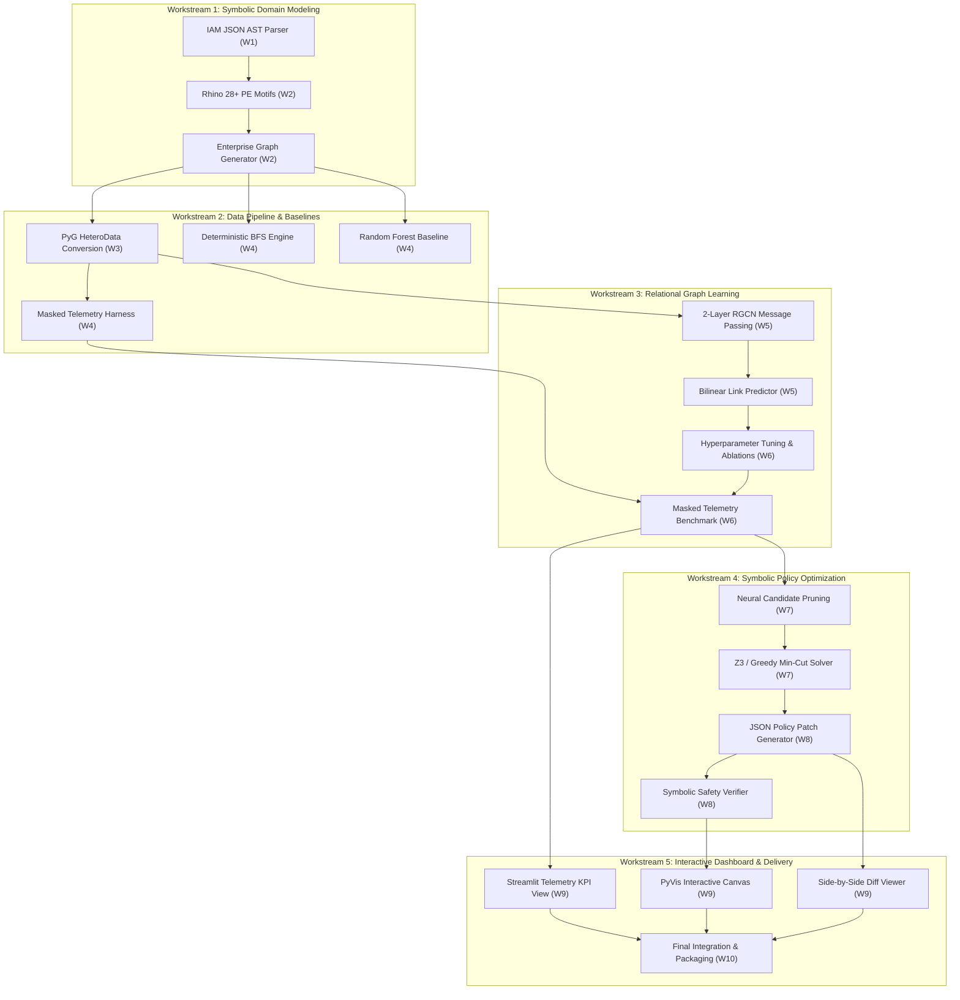

# Project Blueprint & 10-Week Execution Schedule

### Project Title
**Hybrid Symbolic–Relational Graph Learning for Latent Attack-Path Discovery and Least-Privilege Optimization in Cloud IAM**

### Author & Engineering Lead
Currently just me and myself.

---

## 1. Executive Summary & Schedule Overview

This blueprint translates the research and engineering objectives specified in [proposal.md](file:///Users/duke/IAM/proposal.md) into an actionable, phased execution schedule. It adopts a **Two-Tier Strategic Model** tailored for a 1st-year Master's student:

* **Tier 1 (Weeks 1–10: Course Project & Presentable MVP)**: Build an end-to-end demonstrable prototype with an interactive Streamlit + PyVis UI, synthetic cloud generator, 2-layer RGCN link prediction, and calibrated multi-tier policy repair. The primary milestone is a compelling, high-scoring final course presentation and a standout resume portfolio piece.
* **Tier 2 (Weeks 11–48: Master's Thesis & Top-Tier Publication Master Plan)**: Expand the validated prototype across four structured phases: ingesting real-world IaC repositories (Terraform/CloudFormation/CDK), replaying multi-month CloudTrail logs for zero-breakage operational conformance, proving formal soundness theorems, and conducting an empirical practitioner user study targeting top-tier security and software engineering venues (ACM CCS, USENIX Security, IEEE S&P, or ASE/FSE).

```
+---------------------------------------------------------------------------------------------------------+
|                                    10-WEEK PHASE ROADMAP (TIER 1 MVP)                                   |
+---------------------------------------------------------------------------------------------------------+
| Phase 1: Foundations & Synthetic Synthesis (Weeks 1–3)    ───► [M1: Verified Synthetic Cloud Corpus]     |
| Phase 2: Baselines & RGCN Link Prediction (Weeks 4–6)      ───► [M2: Robust Latent Path GNN Engine]        |
| Phase 3: Symbolic Optimization & Policy Diffs (Weeks 7–8) ───► [M3: Multi-Tier Policy Repair Engine]    |
| Phase 4: UI Dashboard, Course Demo & Release (Weeks 9–10) ───► [M4: Course Presentation & MVP Release]   |
+---------------------------------------------------------------------------------------------------------+
|                                    48-WEEK M.S. THESIS & PUBLICATION MASTER PLAN (TIER 2)               |
| Phase I   (M1–3,  W1–12):  Course MVP Delivery & Codebase Refactoring                                   |
| Phase II  (M4–6,  W13–24): Real-World IaC Ingestion & Operational CloudTrail Log Conformance             |
| Phase III (M7–9,  W25–36): Generalized Multi-Tier Z3 MaxSAT Solver & Soundness Proofs                  |
| Phase IV  (M10–12, W37–48): Practitioner User Study, Thesis Defense & Manuscript (ACM CCS / USENIX / S&P)|
+---------------------------------------------------------------------------------------------------------+
```

### Time Allocation & Workload Distribution Matrix

| Phase | Weeks | Core Focus | Est. Hours | Cumulative Hours | Target Milestone |
| :--- | :--- | :--- | :---: | :---: | :--- |
| **Phase 1** | Week 1 | Environment Setup, IAM Parsing & Symbolic Rule Engine | 16h | 16h | IAM AST Parser & Symbolic Constraint Engine |
| | Week 2 | Rhino 28+ PE Catalog & Synthetic Enterprise Graph Generator | 17h | 33h | Parameterized Synthetic Cloud Generator (500–5k nodes) |
| | Week 3 | Graph Serialization, Feature Engineering & PyG Integration | 17h | 50h | **M1: Validated Heterogeneous Cloud Graph Dataset** |
| **Phase 2** | Week 4 | Deterministic BFS (PMapper-style) & Classical ML Baselines | 18h | 68h | Baseline Reachability & Tabular ML Benchmark Suite |
| | Week 5 | RGCN Architecture Design, Message Passing & Loss Engine | 18h | 86h | Functional 2-Layer RGCN with Bilinear Decoder |
| | Week 6 | Model Tuning, Ablation Studies & Masked Telemetry Benchmark| 18h | 104h | **M2: Latent Link Discovery Under Masked Telemetry (RQ1)** |
| **Phase 3** | Week 7 | Constrained Minimal-Cut / MaxSAT Symbolic Solver Module | 17h | 121h | Symbolic Disconnection & Candidate Pruning Engine (RQ3) |
| | Week 8 | Multi-Tier Policy Diff Generator & Formal Verifier | 16h | 137h | **M3: Multi-Tier Least-Privilege Patching System (RQ2)** |
| **Phase 4** | Week 9 | Interactive Streamlit + PyVis Triage Dashboard | 17h | 154h | Full Visual Graph Canvas & Remediation UI |
| | Week 10 | Course Demo Packaging, Benchmarks & Deliverables | 16h | 170h | **M4: Course Presentation MVP & Open-Source Release** |
| **Total** | **10 Weeks** | **Tier 1 Lifecycle (Course MVP & Portfolio)** | **170h** | **170h** | **Presentable End-to-End System** |

---

## 2. Detailed Weekly Breakdown & Task Checklist

---

### Week 1: Environment Setup, IAM Parsing & Symbolic Rule Engine
* **Goal**: Establish the repository infrastructure, data schemas, AWS IAM JSON AST parser, and deterministic symbolic pre-filtering logic for permission flows.
* **Estimated Effort**: 16 Hours

#### Step 1.1: Core Environment & Toolchain Initialization (3.0h)
- [ ] Initialize Python 3.10+ virtual environment and dependency tree (`poetry` / `pip-tools`).
- [ ] Configure development tooling: `ruff` (linter/formatter), `pytest`, `mypy`, and pre-commit hooks.
- [ ] Install deep learning and graph dependencies: `torch`, `torch_geometric`, `networkx`, `scipy`, `z3-solver`.
- [ ] Setup repository layout:
  ```
  iam-graph-learning/
  ├── data/                  # Synthetic schemas and generated graphs
  ├── src/
  │   ├── parser/            # IAM AST and symbolic rule engine
  │   ├── generator/         # Rhino PE motifs and enterprise topology synthesis
  │   ├── models/            # PyG RGCN, decoders, and baselines
  │   ├── optimizer/         # Minimal-cut / MaxSAT symbolic repair
  │   └── dashboard/         # Streamlit and PyVis UI
  ├── tests/                 # Unit, integration, and benchmark tests
  └── notebooks/             # Exploratory analysis and visualization
  ```

#### Step 1.2: Declarative IAM JSON Schema & AST Parser (5.5h)
- [ ] Implement robust IAM policy document parser supporting standard statements (`Effect`, `Action`, `NotAction`, `Resource`, `NotResource`, `Condition`).
- [ ] Build wildcards and expansion resolver (e.g., expanding `iam:*` or `s3:Get*` into canonical action sets).
- [ ] Handle explicit `Deny` resolution adhering to AWS policy evaluation logic: an explicit `Deny` overrides any `Allow` across all scopes.
- [ ] Support conditional logic parsing (e.g., `aws:PrincipalArn`, `aws:SourceIp`, `iam:PassedToService`).

#### Step 1.3: Heterogeneous Node & Edge Relational Abstraction (4.5h)
- [ ] Define canonical node dataclasses:
  - `UserNode` (id, arn, mfa_enabled, groups, tags)
  - `RoleNode` (id, arn, trust_policy, max_session_duration)
  - `PolicyNode` (id, arn, is_managed, policy_document, version)
  - `ResourceNode` (id, arn, service_type, resource_policy)
- [ ] Define relational edge types:
  - `('User', 'MemberOf', 'Group')`
  - `('User'/'Role', 'AttachedWith', 'Policy')`
  - `('Policy', 'ActsOn', 'Resource')`
  - `('User'/'Role', 'AssumesRole', 'Role')`
  - `('Role', 'PassesTo', 'Resource')`
- [ ] Implement NetworkX heterogeneous graph builder to validate directed multigraph constraints.

#### Step 1.4: Unit Tests for IAM Parser & Policy Logic (3.0h)
- [ ] Test wildcards expansion against edge cases (e.g., `iam:*AccessKey*`, action case-insensitivity).
- [ ] Test explicit `Deny` suppression on contradictory policy statements.
- [ ] Validate parsing of multi-statement complex role trust policies.

---

### Week 2: Rhino 28+ PE Catalog & Synthetic Enterprise Graph Generator
* **Goal**: Codify the Rhino Security Labs privilege escalation vectors into formal graph motifs and build a scalable synthetic enterprise cloud graph generator.
* **Estimated Effort**: 17 Hours

#### Step 2.1: Rhino Privilege Escalation Vector Formalization (5.0h)
- [ ] Encode top 28+ AWS IAM privilege escalation vectors as formal graph subgraph motifs:
  - `iam:CreateAccessKey` on target high-privilege user.
  - `iam:CreateLoginProfile` / `iam:UpdateLoginProfile` for console access.
  - `iam:AttachUserPolicy` / `iam:AttachRolePolicy` attaching `AdministratorAccess`.
  - `iam:PutUserPolicy` / `iam:PutRolePolicy` creating inline administrative policies.
  - `iam:SetDefaultPolicyVersion` rolling back to an older permissive version.
  - `iam:PassRole` + `lambda:CreateFunction` + `lambda:InvokeFunction`.
  - `iam:PassRole` + `ec2:RunInstances` with elevated instance profile.
  - `iam:PassRole` + `glue:CreateDevEndpoint`.
  - `iam:UpdateAssumeRolePolicy` modifying trust relationships to allow self-assumption.
- [ ] Construct executable verification rules to label ground-truth escalation paths algorithmically.

#### Step 2.2: Parameterized Enterprise Topology Generator (6.5h)
- [ ] Implement realistic departmental organizational hierarchy (DevOps, Data/BI, SecOps, QA, Billing, Interns).
- [ ] Model power-law identity distribution: small core of Admin/SecOps, moderate DevOps, large long-tail of restricted read-only roles.
- [ ] Incorporate benign business workflows:
  - CI/CD build runners with scoped S3 and ECR permissions.
  - Read-only data analysts querying Athena/S3 with strict KMS access.
- [ ] Implement controlled injection of positive privilege escalation chains (configurable path lengths: 2-hop, 3-hop, 4-hop, and branching paths).
- [ ] Support graph scaling parameters: $N \in [500, 5000]$ nodes with configurable edge density.

#### Step 2.3: Verification of Graph Realism & Ground-Truth Annotation (3.5h)
- [ ] Implement automated ground-truth labeler that outputs all reachable (source, target) privilege escalation pairs.
- [ ] Compute topological sanity checks: in/out-degree distributions, clustering coefficients, and connected components.
- [ ] Export labeled graph datasets into structured JSON / GraphML schemas for downstream modules.

#### Step 2.4: Synthetic Data Generator Unit & Sanity Tests (2.0h)
- [ ] Verify that injected PE chains are syntactically valid and traversable.
- [ ] Ensure benign identities without escalation paths are not falsely annotated as positive escalation targets.
- [ ] Measure generator runtime across node scales (500, 1,000, 2,500, 5,000 nodes).

---

### Week 3: Graph Serialization, Feature Engineering & PyG Integration
* **Goal**: Convert heterogeneous symbolic cloud graphs into PyTorch Geometric `HeteroData` structures with rich multi-hot permission and structural topological feature vectors.
* **Estimated Effort**: 17 Hours

#### Step 3.1: Vocabulary Building & Permission Canonicalization (4.0h)
- [ ] Build global action permission dictionary across AWS services (IAM, STS, Lambda, EC2, S3, KMS, RDS, etc.).
- [ ] Implement frequency-based token pruning and multi-hot vector encoding for policy and principal nodes.
- [ ] Encode resource types and ARN service prefixes into one-hot categorical features.

#### Step 3.2: Structural Node Feature Engineering (4.5h)
- [ ] Compute local and global graph centrality features using NetworkX:
  - In-degree, out-degree, total degree per relation type.
  - Directed PageRank scores.
  - Betweenness centrality approximations (for transitive bottleneck detection).
- [ ] Concatenate multi-hot permission vectors, node-type one-hot embeddings, and continuous topological metrics into unified initial feature matrices $X_v \in \mathbb{R}^{d_v}$ for each node type $v \in \mathcal{V}$.

#### Step 3.3: PyTorch Geometric `HeteroData` Conversion Pipeline (4.5h)
- [ ] Map NetworkX multigraph into `torch_geometric.data.HeteroData`.
- [ ] Build typed edge indices `edge_index_dict` for all relations:
  - `('User', 'MemberOf', 'Group')`
  - `('Principal', 'AssumesRole', 'Role')`
  - `('Principal', 'AttachedWith', 'Policy')`
  - `('Role', 'PassesTo', 'Resource')`
- [ ] Add inverse relations (e.g., `RevAssumesRole`, `RevAttachedWith`) to facilitate bidirectional message passing in GNN layers.

#### Step 3.4: Train / Validation / Test Graph Splitting Strategy (4.0h)
- [ ] Implement inductive and transductive edge splitters for link prediction.
- [ ] Ensure no data leakage: positive escalation test edges and their intermediate hops are isolated during link prediction evaluation.
- [ ] Implement balanced negative edge sampling: generate plausible non-escalating identity pairs (e.g., standard cross-departmental pairs) to prevent degenerate classification.

---

### Week 4: Deterministic BFS & Classical ML Baselines
* **Goal**: Implement standard evaluation baselines: a deterministic BFS reachability engine (analogous to PMapper) and a tabular machine learning model (Random Forest / XGBoost) trained on centrality features.
* **Estimated Effort**: 18 Hours

#### Step 4.1: Deterministic BFS Multi-Hop Reachability Engine (PMapper-style) (5.5h)
- [ ] Implement stateful Breadth-First Search (BFS) and Dijkstra shortest-path reachability over the symbolic cloud graph.
- [ ] Model conditional rule evaluation during path traversal (e.g., tracking current active session credentials during role-chaining).
- [ ] Add cycle detection and max-depth bounding ($k \le 6$ hops) to avoid combinatorial traversal traps.
- [ ] Output full deterministic attack paths with explicit edge attribution.

#### Step 4.2: Classical Machine Learning Baseline (Random Forest / Gradient Boosted Trees) (5.0h)
- [ ] Extract tabular feature vectors for principal pairs $(u, v)$:
  - Source node degree, target node in-degree.
  - Jaccard and Adamic-Adar similarity coefficients over common neighbors.
  - Shortest path distance in current observed topology.
  - Raw count of administrative permissions held by source and target.
- [ ] Train a `RandomForestClassifier` and `XGBoostClassifier` to predict binary escalation reachability.
- [ ] Tune tree depth, estimators, and class weights to account for edge sparsity.

#### Step 4.3: Baseline Evaluation Harness & Metrics Suite (4.5h)
- [ ] Build unified evaluation harness computing:
  - ROC-AUC (Receiver Operating Characteristic Area Under Curve).
  - PR-AUC (Precision-Recall Area Under Curve).
  - Top-$k$ Hits ($Hits@10$, $Hits@50$).
  - Mean Reciprocal Rank (MRR).
  - Wall-clock runtime and memory footprint.
- [ ] Evaluate deterministic BFS and Random Forest on fully observed synthetic datasets ($N = 1000$ and $N = 3000$).

#### Step 4.4: Telemetry Masking Framework Setup (3.0h)
- [ ] Build parameterized graph masking module: randomly mask $p \in \{0.10, 0.20, 0.30, 0.40\}$ of intermediate trust edges (`AssumesRole`, `PassesTo`, `AttachedWith`).
- [ ] Document deterministic BFS performance degradation as masking probability increases (confirming theoretical reachability collapse).

---

### Week 5: RGCN Architecture Design, Message Passing & Loss Engine
* **Goal**: Implement the 2-layer Relational Graph Convolutional Network (RGCN) with basis-sharing regularization, a bilinear link prediction head, and hard negative edge sampling.
* **Estimated Effort**: 18 Hours

#### Step 5.1: Multi-Relational Message Passing Layer (6.0h)
- [ ] Implement 2-layer `RGCNConv` module using PyG:
  $$h_i^{(l+1)} = \sigma \left( W_0^{(l)} h_i^{(l)} + \sum_{r \in \mathcal{R}} \sum_{j \in \mathcal{N}_i^r} \frac{1}{c_{i,r}} W_r^{(l)} h_j^{(l)} \right)$$
- [ ] Implement basis-sharing regularization to constrain parameter proliferation across diverse edge relations:
  $$W_r^{(l)} = \sum_{b=1}^{B} a_{r,b}^{(l)} V_b^{(l)}$$
- [ ] Add layer normalization, dropout ($p = 0.2$), and LeakyReLU / ELU activation functions.
- [ ] Support heterogeneous node type projections to align heterogeneous input dimensions into a uniform hidden dimension ($d_{hidden} = 128$).

#### Step 5.2: Bilinear & DistMult Link Prediction Decoder (4.5h)
- [ ] Design link prediction scoring head for latent escalation triples $(s, r_{\text{escalate}}, t)$:
  $$\text{Score}(s, t) = \sigma \left( h_s^T W_{\text{escalate}} h_t + b \right)$$
- [ ] Implement alternative DistMult score head for comparative efficiency analysis:
  $$\text{Score}(s, t) = \sigma \left( \sum_k (h_s)_k (w_{\text{escalate}})_k (h_t)_k \right)$$
- [ ] Map score output to continuous Blast-Radius metric representing cumulative escalation probability into high-value targets.

#### Step 5.3: Loss Function & Hard Negative Edge Sampling (4.5h)
- [ ] Formulate Binary Cross-Entropy (BCE) loss with focal weighting to combat extreme class imbalance:
  $$\mathcal{L} = -\sum_{(u, v) \in \mathcal{E}^+} \log \hat{y}_{uv} - \lambda \sum_{(u', v') \in \mathcal{E}^-} \log (1 - \hat{y}_{u'v'})$$
- [ ] Implement dynamic negative edge sampling:
  - Uniform negative sampling across unconnected identity-role pairs.
  - Hard negative mining: sample non-escalating identities sharing similar permissions or departments to force the model to learn structural distinctions.

#### Step 5.4: Training Loop & Checkpointing (3.0h)
- [ ] Build modular PyTorch training loop with AdamW optimizer, cosine annealing learning rate scheduler, and gradient clipping.
- [ ] Add early stopping based on validation PR-AUC.
- [ ] Implement TensorBoard / Weights & Biases logging for loss, gradient norms, and validation metrics.

---

### Week 6: Model Tuning, Ablation Studies & Masked Telemetry Benchmark
* **Goal**: Optimize the RGCN model, execute comprehensive ablation studies, and run the core benchmark proving robustness under incomplete/masked telemetry against baselines.
* **Estimated Effort**: 18 Hours

#### Step 6.1: Hyperparameter Optimization & Architecture Exploration (5.0h)
- [ ] Conduct grid/random search over key hyperparameters:
  - Hidden dimensions: $d \in \{64, 128, 256\}$.
  - Number of basis functions: $B \in \{4, 8, 16, 32\}$.
  - Number of RGCN layers: $L \in \{1, 2, 3\}$ (validating that 2 layers avoids over-smoothing).
  - Dropout rates: $p \in \{0.1, 0.2, 0.3, 0.5\}$.
  - Learning rates: $\eta \in \{10^{-4}, 5 \times 10^{-4}, 10^{-3}\}$.
- [ ] Select best checkpoint meeting criteria: **ROC-AUC $\ge$ 0.90**, **PR-AUC $\ge$ 0.85**.

#### Step 6.2: Ablation Experiments (4.5h)
- [ ] Ablation 1: Remove typed relational convolutions (standard GCN vs RGCN) to prove the necessity of relational semantics.
- [ ] Ablation 2: Remove structural centrality features (raw permissions only vs enriched node features).
- [ ] Ablation 3: Remove symbolic pre-filtering (raw syntax graph vs symbolically pruned graph) to quantify hallucination reduction.

#### Step 6.3: The Masked Telemetry Benchmark (5.5h)
- [ ] Execute rigorous comparison across 5 random seeds for masking levels:
  $$\text{Mask Ratio } p \in \{0.0, 0.10, 0.20, 0.30, 0.40\}$$
- [ ] Evaluate three models across all masking conditions:
  1. Deterministic BFS Reachability Engine (PMapper proxy).
  2. Random Forest Baseline.
  3. Hybrid RGCN Model.
- [ ] Collect empirical proof of the primary thesis:
  - Deterministic BFS recall drops from $\sim 100\%$ at $p=0.0$ to $< 25\%$ at $p=0.30$.
  - RGCN maintains robust ROC-AUC $\ge 0.80$ at $p=0.30$ and $p=0.40$ by predicting latent trust.

#### Step 6.4: Export Benchmark Tables & Plots (3.0h)
- [ ] Generate publication-grade matplotlib/seaborn visualization:
  - ROC and Precision-Recall curves.
  - Detection recall vs edge masking ratio curve.
- [ ] Export structured benchmark CSV/JSON summaries for inclusion in the dashboard and final documentation.

---

### Week 7: Constrained Minimal-Cut / MaxSAT Symbolic Solver Module (MVP Calibration)
* **Goal**: Implement the primary 10-week remediation engine using a fast greedy bottleneck min-cut with targeted ARN scoping, and prototype a formal Z3 MaxSAT condition-injection solver on 3 canonical attack motifs.
* **Estimated Effort**: 17 Hours

#### Step 7.1: Least-Privilege Optimization Problem Formulation (4.5h)
- [ ] Formalize the remediation objective:
  - Let $G = (\mathcal{V}, \mathcal{E})$ be the enterprise permission graph.
  - Given flagged high-risk source identity $s$ and target administrative role $t$.
  - Find a minimal edge/permission cut $\mathcal{C}^* \subseteq \mathcal{E}$ such that $t$ is unreachable from $s$ in $G' = (\mathcal{V}, \mathcal{E} \setminus \mathcal{C}^*)$.
  - Subject to: $\sum_{e \in \mathcal{C}^*} \text{Cost}(e)$ is minimized, where $\text{Cost}(e)$ penalizes revoking actively utilized permissions.
- [ ] Incorporate operational workflow constraints: simulated CloudTrail activity logs assign near-infinite penalty weights to actively exercised permissions to eliminate production breakage.

#### Step 7.2: Neural-to-Symbolic Candidate Space Pruning (4.0h)
- [ ] Use RGCN link prediction scores and layer-wise attention/edge attribution to rank critical intermediate edges along predicted escalation paths.
- [ ] Prune graph to candidate subgraph $G_{cand} \subset G$ containing the top-$k$ high-risk paths, shrinking search space from $10^4$ edges to $< 50$ edges for real-time interactive solving ($< 3.0$s).

#### Step 7.3: Dual-Engine Solver Implementation (Greedy MVP + 3-Scenario Z3 Prototype) (5.5h)
- [ ] **Engine 1 (Primary 10-Week Course MVP):** Implement deterministic greedy bottleneck min-cut with action subtraction and ARN scoping. This guarantees instant, failure-proof remediation during live course presentations.
- [ ] **Engine 2 (Selective Z3 MaxSAT Prototype):** Implement formal Z3 MaxSAT constraint solver scoped to 3 canonical Rhino PE vectors:
  1. `iam:PassRole` + `lambda:CreateFunction` (Resource ARN restriction).
  2. `iam:UpdateAssumeRolePolicy` (ABAC trust condition injection: MFA / IP).
  3. `iam:CreateAccessKey` (Action subtraction).
- [ ] Add automatic timeout fallback: if Z3 takes $> 3.0$ seconds on arbitrary topologies, gracefully fall back to Engine 1 (greedy min-cut). Full-scale generalized arbitrary-graph Z3 solving is formally scheduled for Tier 2 (Weeks 25–36).

#### Step 7.4: Solver Benchmarking & Correctness Tests (3.0h)
- [ ] Unit test on the 3 canonical Rhino PE chains: verify that solver identifies the minimal cut (e.g., scoping `Resource: "*"` to specific role ARN vs revoking entire role).
- [ ] Benchmark solve-times across candidate subgraph sizes (10 to 100 candidate edges), proving sub-second execution for the course demo.

---

### Week 8: Multi-Tier Policy Diff Generator & Formal Verifier
* **Goal**: Translate abstract graph cuts into concrete, syntactically valid AWS IAM JSON policy diffs, verify remediation against symbolic rules, and compute blast-radius reduction.
* **Estimated Effort**: 16 Hours

#### Step 8.1: JSON Policy Diff & Patch Synthesizer (5.0h)
- [ ] Map abstract edge cuts back to concrete policy statements across the three repair tiers:
  - Tier 1 (Action Subtraction): Remove offending action (e.g., strip `iam:CreateAccessKey` while retaining read permissions).
  - Tier 2 (Resource ARN Scoping - MVP Highlight): Restrict wildcard `Resource: "*"` to explicit trusted ARNs (e.g., `Resource: "arn:aws:iam::123:role/AllowedSandboxRole"`).
  - Tier 3 (Condition Injection): Append conditional guardrails (e.g., requiring MFA or specific IP range).
- [ ] Generate standardized unified JSON diff representation:
  ```json
  {
    "policy_arn": "arn:aws:iam::123456789012:policy/DevLambdaExecutor",
    "target_identity": "usr-test-contractor",
    "patch_action": "RESTRICT_RESOURCE_ARN",
    "diff": {
      "old_statement": {
        "Action": ["iam:PassRole", "lambda:CreateFunction"],
        "Resource": "*"
      },
      "new_statement": {
        "Action": ["iam:PassRole", "lambda:CreateFunction"],
        "Resource": "arn:aws:iam::123456789012:role/SandboxExecutionRole"
      }
    },
    "log_conformance_guarantee": "100% of historical CloudTrail events preserved"
  }
  ```

#### Step 8.2: Post-Remediation Symbolic Verifier (4.5h)
- [ ] Implement in-memory policy patch applier that yields patched graph $G_{repaired}$.
- [ ] Run symbolic verifier over $G_{repaired}$:
  - Confirm deterministic path between source $s$ and target $t$ is completely disconnected.
  - Ensure patch does not introduce side-effect escalations.
  - Replay synthetic CloudTrail activity logs to confirm zero legitimate operational breakage.

#### Step 8.3: Blast Radius Metric Computation Engine (3.5h)
- [ ] Implement before-and-after blast radius calculator:
  $$\text{BlastRadius}(u) = \frac{|\text{ReachableResources}(u)|}{|\mathcal{V}_{\text{Resource}}|} \times \max_{r \in \text{Reachable}} \text{RiskWeight}(r)$$
- [ ] Compute metrics:
  - Percentage Blast Radius Reduction (target: $\ge 80\%$).
  - Permission Removal Ratio (target: $< 15\%$ total permissions removed).

#### Step 8.4: Integration Tests for Remediation Pipeline (3.0h)
- [ ] Test complete pipeline on 20 distinct synthetic attack scenarios.
- [ ] Verify that all generated policy JSON snippets conform strictly to AWS IAM syntax specifications.

---

### Week 9: Interactive Streamlit + PyVis Triage Dashboard
* **Goal**: Build a web-based auditing and visual triage dashboard using Streamlit and PyVis, delivering high-level telemetry, risk tables, interactive graph rendering, and one-click policy diff triage.
* **Estimated Effort**: 17 Hours

#### Step 9.1: Streamlit Dashboard Skeleton & Telemetry KPIs (4.0h)
- [ ] Implement modern, clean multi-page Streamlit dashboard architecture:
  - Overview / Posture KPI Banner: Scanned Identities, Evaluated Policies, Latent Risks Found, Average Blast Radius.
  - High-Risk Identity Triage Table with search, department filtering, and severity badges (Critical, High, Medium, Benign).
- [ ] Display top latent attack paths with continuous model confidence scores.

#### Step 9.2: PyVis Interactive Graph Canvas Integration (Ego-Network Scoped) (5.5h)
- [ ] Implement PyVis force-directed graph visualization embedded inside Streamlit.
- [ ] **Performance Safeguard (Ego-Network Scoping):** To guarantee silky-smooth 60fps rendering without browser DOM lag during live presentations, scope the canvas to the **$k \le 2$ hop ego-network** around selected high-risk principals rather than rendering the global $2000+$ node topology.
- [ ] Node styling:
  - `User`: Blue circle.
  - `Role`: Orange box.
  - `Policy`: Purple hexagon.
  - `Admin Role / Target`: Red star / diamond.
- [ ] Edge styling:
  - Observed edges: solid gray/blue lines with relation labels.
  - Latent GNN-inferred edges: pulsing/dashed red lines with prediction probability weights.
- [ ] Interactive features: physics stabilization, node dragging, click-to-inspect attributes drawer, and path highlighting.

#### Step 9.3: Remediation & Policy Diff Viewer Component (4.5h)
- [ ] Create interactive remediation drawer:
  - Displays selected identity and target escalation chain.
  - Side-by-side colorized JSON diff viewer showing before-and-after policy statements.
  - Simulated impact panel: Expected blast radius reduction percentage and affected workflows.
- [ ] Add "Apply Patch Simulation" toggle that updates the PyVis graph canvas in real time to show severed attack paths.

#### Step 9.4: End-to-End UI Usability Testing & Styling (3.0h)
- [ ] Test dashboard performance on graphs of 500 to 2,000 nodes (optimize PyVis physics rendering and node filtering).
- [ ] Polish UI with custom CSS for enterprise security dashboard aesthetics.

---

### Week 10: End-to-End Benchmarking, Documentation & Demo Packaging
* **Goal**: Conduct full end-to-end evaluation, finalize all repository documentation, produce a reproducible demo script, and package final deliverables.
* **Estimated Effort**: 16 Hours

#### Step 10.1: Full Pipeline Benchmark Run & Results Compilation (4.5h)
- [ ] Execute comprehensive automated test suite across all dataset sizes (500, 1,000, 3,000, 5,000 nodes).
- [ ] Record final quantitative results:
  - Latent link prediction: ROC-AUC, PR-AUC, MRR.
  - Masked telemetry comparison table: BFS vs Random Forest vs RGCN (0% to 40% masking).
  - Remediation statistics: average blast radius reduction and permission revocation ratio.
- [ ] Generate final comparison charts and summary markdown tables.

#### Step 10.2: Codebase Refactoring & Type Annotations (3.5h)
- [ ] Clean up all codebase modules, ensure 100% adherence to `ruff` linting rules.
- [ ] Add complete Python type hints and docstrings across public API functions.
- [ ] Validate unit test suite coverage (`pytest --cov=src` aiming for $> 85\%$ core logic coverage).

#### Step 10.3: Documentation, User Guide & Reproducibility (4.5h)
- [ ] Write comprehensive `README.md`:
  - Architecture diagram and methodology overview.
  - Quickstart guide: single-command synthetic graph generation, training, and dashboard launch.
  - Detailed CLI command reference (`generate`, `train`, `evaluate`, `remediate`, `dashboard`).
  - Benchmark reproduction instructions.
- [ ] Create `reproduce_results.sh` script to automate all experiments from scratch with a single command.

#### Step 10.4: Final Demo Recording & Deliverable Packaging (3.5h)
- [ ] Record a 3-minute video/GIF walkthrough of the interactive Streamlit dashboard discovering a latent attack path and applying a minimal least-privilege diff.
- [ ] Tag GitHub release milestone `v1.0.0` with frozen model weights and sample synthetic cloud graphs.

---

## 3. Technical Workstream Dependency Architecture

The project architecture connects five modular engineering workstreams with explicit dependency flows:



---

## 4. Risk Assessment & Engineering Contingencies

| Risk ID | Technical Risk Description | Severity | Probability | Proposed Mitigation & Fallback Strategy |
| :---: | :--- | :---: | :---: | :--- |
| **R-01** | **PyG RGCN Over-smoothing or Gradient Vanishing**: Multi-relational graph convolution over sparse enterprise topologies degrades representation quality at $L \ge 3$. | Medium | Medium | Restrict depth to 2 layers; introduce residual skip-connections (`skip_connect=True`) and layer normalization. |
| **R-02** | **Extreme Class Imbalance in Link Prediction**: The ratio of positive escalation chains to non-escalating pairs is $< 1:1000$. | High | High | Implement focal loss ($\gamma = 2.0$) with dynamic hard-negative sampling; prioritize departmental negative pairs over uniform random pairs. |
| **R-03** | **Z3 SMT Solver Timeout on Large Subgraphs**: Combinatorial explosion when evaluating paths exceeding 5 hops in complex enterprise clusters. | High | Low | Apply GNN attention weights to prune candidate subgraph to top 30 critical edges before passing to Z3; establish 3.0s timeout with automatic fallback to greedy bottleneck min-cut. |
| **R-04** | **PyVis Rendering Latency in Streamlit**: Rendering graphs exceeding 2,000 nodes directly in browser canvas causes frame drops. | Medium | Medium | Implement subgraph neighborhood scoping in UI: render only the $k$-hop ego-network around selected high-risk identities rather than the global enterprise graph. |
| **R-05** | **Synthetic Bias in Graph Generator**: Neural model overfits to synthetic graph generation artifacts rather than underlying IAM semantics. | High | Medium | Randomize graph generation seeds; systematically vary branch factors, departmental sizes, and inject noisy non-escalating multi-hop role assumptions. |

---

## 5. Milestone Verification Checklist

- [ ] **Milestone 1 (End of Week 3)**:
  - Fully working synthetic cloud generator producing 500 to 5,000 node graphs.
  - Successful PyTorch Geometric `HeteroData` serialization with zero tensor shape errors.
  - Verified ground-truth labeling for Rhino 28+ privilege escalation vectors.
- [ ] **Milestone 2 (End of Week 6)**:
  - Deterministic BFS and Random Forest baselines fully implemented and benchmarked.
  - 2-layer RGCN achieving ROC-AUC $\ge 0.90$ and PR-AUC $\ge 0.85$ on clean test graphs.
  - Masked telemetry benchmark demonstrating RGCN maintains AUC $\ge 0.80$ at 30% masking while deterministic BFS recall collapses (Answering RQ1).
- [ ] **Milestone 3 (End of Week 8)**:
  - Multi-tier symbolic repair module generating actionable JSON policy diffs across Action Subtraction, Resource ARN Scoping, and ABAC Conditions (Answering RQ2).
  - Formally verified blast-radius reduction $\ge 80\%$ with $< 15\%$ total permissions removed.
  - Patched graphs verified to contain zero false-escape privilege escalation routes.
- [ ] **Milestone 4 (End of Week 10)**:
  - Interactive Streamlit + PyVis triage dashboard functioning smoothly on end-user machines.
  - Clean, modular codebase passing all unit/lint tests with automated reproduction script.
  - Course presentation slide deck, demo recording, and open-source GitHub release (`v1.0.0`).

---

## 6. Course Presentation Minimum Viable Presentation (MVP) Guide

For a 1st-year graduate course presentation (10–15 minutes), the priority is delivering **high conceptual clarity, a compelling live demonstration, and clear empirical contrast against baselines**. Even if certain advanced SMT solver edge-cases remain ongoing work, the following package ensures an A-grade presentation:

### 6.1 Recommended Presentation Slide Structure (10–12 Slides)
1. **The Cloud IAM Crisis**: Visualizing identity sprawl, multi-hop role chaining, and the failure of perimeter security.
2. **Prior Art & The Dichotomy**: PMapper (BFS) brittle to missing edges; IAMPERE (ASE '23) assuming 100% whitebox graphs with coarse action deletion.
3. **Core Research Thesis & Novelty**:
   - Inferring latent trust paths under incomplete telemetry via Relational GCNs.
   - Multi-tier policy repair (Resource Scoping & ABAC Conditions) preserving operational utility.
4. **Graph Formulation**: Heterogeneous multigraph schema (`User`, `Role`, `Policy`, `Resource`).
5. **The RGCN Architecture**: Typed message passing, basis sharing, bilinear link prediction decoder.
6. **Experimental Result 1 (Latent Discovery)**: ROC-AUC / PR-AUC curves showing strong link prediction on held-out escalation paths.
7. **Experimental Result 2 (Masked Telemetry Proof - The Punchline)**: Side-by-side plot showing BFS detection collapsing to $< 25\%$ at 30% edge masking, while RGCN maintains $> 80\%$ AUC.
8. **Multi-Tier Policy Repair**: Side-by-side contrast: revoking `iam:PassRole` (breaks DevOps) vs. scoping `Resource: "*"` to specific worker ARN (safe & secure).
9. **Live Demonstration**: 2-minute walkthrough of the Streamlit + PyVis interactive dashboard.
10. **Limitations & Future Thesis Roadmap**: Bridging from synthetic graphs to live AWS Organizations.

### 6.2 Standby Fallback Strategies
* *If the PyG RGCN training is partially tuned by Week 10:* The visual dashboard can load pre-cached embeddings and validation outputs from a saved checkpoint, ensuring zero risk of a live-demo crash.
* *If the Z3 MaxSAT solver has timeouts on certain complex subgraphs:* Present the greedy bottleneck min-cut algorithm as the primary real-time solver, demonstrating Z3 on small-to-medium candidate paths.

---

## 7. Tier 2: 48-Week Master's Thesis & Top-Tier Publication Master Plan

To elevate the validated 10-week Course MVP into a peer-reviewed Master's Thesis and a top-tier security/software engineering paper (e.g., **ACM CCS, USENIX Security, IEEE S&P, or ASE/FSE**), the project expands across a four-phase, 48-week master plan:

```
+---------------------------------------------------------------------------------------------------------+
|                               48-WEEK MASTER'S THESIS & PUBLICATION MASTER PLAN                        |
+---------------------------------------------------------------------------------------------------------+
| Phase I   (Months 1–3,  Weeks 1–12):  Course MVP Delivery & Synthetic Benchmark Consolidation           |
| Phase II  (Months 4–6,  Weeks 13–24): Real-World IaC Ingestion & Operational CloudTrail Conformance     |
| Phase III (Months 7–9,  Weeks 25–36): Generalized Multi-Tier Z3 MaxSAT Solver & Cross-Account Evaluation|
| Phase IV  (Months 10–12, Weeks 37–48): Security Practitioner User Study, Thesis Defense & Manuscript    |
+---------------------------------------------------------------------------------------------------------+
```

### 7.1 Phase I: Course MVP Delivery & Synthetic Benchmark Consolidation (Months 1–3 / Weeks 1–12)
* **Strategic Objective:** Complete the graduate course presentation, consolidate synthetic benchmarks, and modularize the codebase for long-term research scalability.
* **Work Packages:**
  - **Weeks 1–10 (Tier 1 Execution):** Execute the 10-week Course MVP roadmap, culminating in Milestone 4 (working interactive Streamlit UI, proof of latent link prediction under masked telemetry, and greedy min-cut policy diffs).
  - **Weeks 11–12 (Codebase Refactoring & Scaling):** Clean up the repository into an installable Python package (`pip install -e .`), refactor graph structures for multi-account scalability, and benchmark synthetic graph generation across 5,000 to 10,000 nodes across all 28 Rhino PE vectors.

### 7.2 Phase II: Real-World IaC Ingestion & Operational Conformance Engine (Months 4–6 / Weeks 13–24)
* **Strategic Objective:** Address the "synthetic circularity" critique by validating against real-world Infrastructure-as-Code (IaC) repositories and building the CloudTrail log-conformance engine.
* **Work Packages:**
  - **Weeks 13–16 (Mining Real-World IaC Repositories):**
    - Build automated AST parsers for Terraform HCL (`terraform-iam`), AWS CloudFormation YAML/JSON, and AWS CDK.
    - Scrape and parse 200+ high-star GitHub repositories with complex enterprise permissions to construct non-synthetic, ecologically valid cloud graphs.
    - Ingest TAC-Bench (2,500 real-world inspired IAM misconfiguration benchmarks) to establish direct baseline comparability.
  - **Weeks 17–20 (CloudTrail Operational Conformance Engine):**
    - Build an AWS CloudTrail API log ingestion pipeline: parse multi-month JSON event records (`LookupEvents`, S3 event streams).
    - Map principal activity to historical permission usage vectors, defining active utility weights $w_p \in [0, \infty)$.
    - Formulate automated log-conformance verification: prove that $100\%$ of historically executed benign actions remain fully authorized under generated policy patches.
  - **Weeks 21–24 (Incomplete Telemetry Threat Modeling on Real Multi-Accounts):**
    - Implement live multi-account ingestion via AWS Organizations SDK (`boto3`).
    - Empirically simulate the 3 industrial blind spots (siloed accounts where target role trust policies are unobservable, third-party GitHub Actions OIDC roles, and ephemeral STS sessions).
    - Benchmark RGCN link prediction recall against deterministic BFS and Random Forest on real-world graphs.

### 7.3 Phase III: Generalized Multi-Tier Z3 MaxSAT Solver & Cross-Account Evaluation (Months 7–9 / Weeks 25–36)
* **Strategic Objective:** Upgrade from the 3-scenario prototype to a fully generalized multi-tier Z3 MaxSAT repair engine, conduct formal soundness proofs, and execute head-to-head benchmarking against IAMPERE.
* **Work Packages:**
  - **Weeks 25–28 (Full Generalized Multi-Tier Z3 MaxSAT Engine):**
    - Generalize the Z3 solver to handle arbitrary, multi-branching escalation paths across all 3 repair tiers (Action Subtraction, Resource ARN Scoping, ABAC Condition Injection) simultaneously.
    - Implement hierarchical constraint optimization: minimize broken CloudTrail logs (hard constraint), maximize blast radius reduction (primary objective), and minimize patch size (secondary objective).
  - **Weeks 29–32 (Head-to-Head Benchmarking Against IAMPERE & SOTA):**
    - Execute direct experimental comparisons against IAMPERE (ASE '23) and TAC (2023):
      - Metric 1: Solve time across 100 to 5,000 node graphs.
      - Metric 2: Patch minimality and expressiveness (action deletion vs. ARN scoping).
      - Metric 3: Production breakage (demonstrating that IAMPERE breaks $20–40\%$ of active CI/CD actions while our multi-tier repair achieves $0\%$ breakage via log conformance).
  - **Weeks 33–36 (Formal Soundness Theorems & Cross-Cloud Extensions):**
    - Mathematically formulate and prove soundness theorems: showing that if the Z3 optimizer returns SAT, the repaired graph contains zero reachable escalation paths for the target threat model.
    - Conduct pilot generalization experiments on Azure RBAC and Google Cloud Platform (GCP) IAM service-account delegations.

### 7.4 Phase IV: Security Practitioner User Study, Thesis Defense & Manuscript Preparation (Months 10–12 / Weeks 37–48)
* **Strategic Objective:** Conduct an empirical human-in-the-loop user study, defend the Master's Thesis, and package the final manuscript for a top-tier cybersecurity / software engineering conference.
* **Work Packages:**
  - **Weeks 37–40 (Human-in-the-Loop Security Practitioner Study):**
    - Design and IRB-clear an empirical user study with $N = 12–16$ professional cloud security engineers and DevOps practitioners.
    - Measure triage velocity, identification accuracy, and patch confidence comparing traditional CLI/PMapper outputs against our interactive visual triage dashboard.
    - Statistically analyze cognitive workload (NASA-TLX) and error rates.
  - **Weeks 41–44 (Thesis Writing & Defense Preparation):**
    - Draft the comprehensive Master's Thesis document (60–80 pages) incorporating formal problem formulation, RGCN link prediction theory, multi-tier MaxSAT mechanics, empirical benchmarks, and user study results.
    - Conduct thesis committee review and deliver the formal M.S. thesis defense.
  - **Weeks 45–48 (Top-Tier Conference Manuscript Submission):**
    - Condense thesis into a rigorous 12–14 page camera-ready format (IEEE/ACM double-column).
    - Prepare open-source artifact evaluation package (Dockerized benchmarks, pre-trained weights, anonymized datasets).
    - Submit manuscript to target tier-1 venues: **ACM CCS, USENIX Security, IEEE S&P, or ASE/FSE**.

